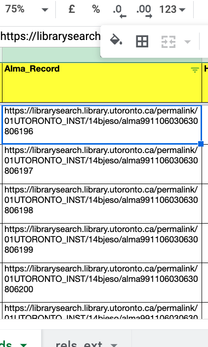
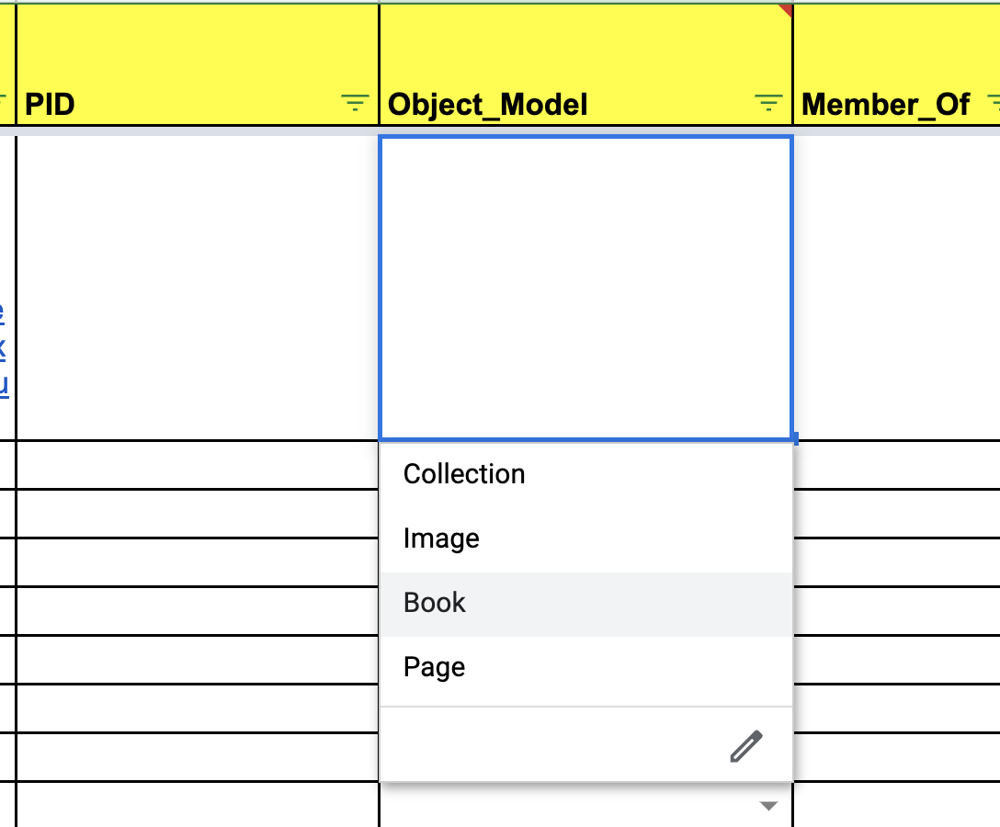
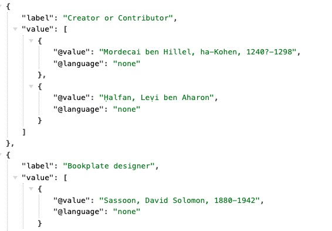

# Collections U of T Metadata Instructions

This page provides information about Collections U of T metadata and instructions to create metadata for ingest into Collections U of T.

Each Collections U of T repository is provided with a metadata spreadsheet template. The instructions below will assist collection owners in using the spreadsheet template to create metadata.

Metadata can be created for collection, book, page, and image items.

The [Collections U of T Metadata Spreadsheet Template](https://docs.google.com/spreadsheets/d/1PMtZt5CzkidIXbTBUaoi8Qg7kBU-m9RzeM-lBMORPks/edit?usp=sharing) is currently stored in Google Drive for easiest access (U of T OneDrive all-staff links have an expiry date).

**Skip to:**
* [Getting Started](https://utlib.github.io/collections-uoft/documentation/metadata#getting-started-with-collections-u-of-t-metadata)
* [Collections U of T Element Details](https://utlib.github.io/collections-uoft/documentation/metadata#collections-u-of-t-element-details)
* [PID/Filename/Identifier Tips](https://utlib.github.io/collections-uoft/documentation/metadata#pidfilenameidentifier-tips)
* [Pre-Ingest Checklist](https://utlib.github.io/collections-uoft/documentation/metadata#pre-ingest-checklist)
* [Google Sheets Tips](https://utlib.github.io/collections-uoft/documentation/metadata#google-sheets-tips)
* [MARC > CSV - MARCEdit Tips](https://utlib.github.io/collections-uoft/documentation/metadata#marcedit-tips)
* [OpenRefine Tips](https://utlib.github.io/collections-uoft/documentation/metadata#openrefine-tips)
* [How do I update Metadata Labels on Collections U of T for my collection?](https://utlib.github.io/collections-uoft/documentation/metadata#how-do-i-alter-the-metadata-labels-that-publicly-display-for-my-collection-on-collections-u-of-t)

## Getting Started with Collections U of T Metadata

First, if you have existing MARC records to work with you can scroll to [MARCEdit Tips](metadata_template_instructions.md#marcedit-tips) to read more about converting MARC records into a Collections U of T spreadsheet.

If you have an existing database of metadata and would like help exporting it, email [digitalinitiatives@library.utoronto.ca](mailto:digitalinitiatives@library.utoronto.ca).

If you are creating your metadata spreadsheet from scratch, start by downloading or making your own Google Drive copy of the [Collections U of T metadata spreadsheet template - all fields](https://docs.google.com/spreadsheets/d/1PMtZt5CzkidIXbTBUaoi8Qg7kBU-m9RzeM-lBMORPks/edit?usp=sharing).

After copying or downloading, rename the spreadsheet with the PID or title of your collection. It can be helpful to have **one spreadsheet per collection**. 

If you wish, you can store this new spreadsheet copy on your U of T staff OneDrive or continue working in Google Sheets.

## Collections U of T Element Details

After copying the spreadsheet, begin filling in the spreadsheet for your collection(s) based on the [Collections U of T Element Details](https://docs.google.com/spreadsheets/d/1EidYREGS521xZKoxBN3Fl-PzkJnNJAR_zftuXXwQsZg/edit#gid=0). If you have any questions about any of the elements, contact Collections U of T staff for support.

### PID/Filename/Identifier Tips

See [slide deck](https://docs.google.com/presentation/d/1W2PWTBE22rj15h7FbVDgAv5DIfg33rnn-1vLQZ_qgDw/edit?usp=sharing) on PID/Filename/Identifier tips. 

## Pre-Ingest Checklist

* Check that PIDs are correctly formatted (see above)
* Check for entity codes - i.e. *$amp;* in place of *&*. Note that you *are* able to represent the actual special character in the spreadsheet metadata - i.e. *&*. The ingest script accepts special characters - so long as spreadsheets are saved with UTF-8 encoding
* Check each column you have filled in against the [Element Details](https://docs.google.com/spreadsheets/d/1EidYREGS521xZKoxBN3Fl-PzkJnNJAR_zftuXXwQsZg/edit#gid=0) Input Guidelines to ensure you are following Collections U of T metadata rules
* Check for spelling errors
* Check for duplicate words or terms
* Check that the file paths to your digital images are correct

## Google Sheets Tips

The Google Sheet template is formatted to assist you with entering data for ingest into Collections. The instructions below can help you if you would like to add additional formatting to the spreadsheet.

### Fill down

Double click the blue box in the bottom right of the cell to fill a value down.

### Create Dropdown

1. Open a spreadsheet in [Google Sheets](https://docs.google.com/spreadsheets/).
2. Select the cell or cells where you want to create a drop-down list.
3. Click Data  Data validation.
4. Next to "Criteria," choose an option:
    * List from a range: Choose the cells that will be included in the list.
    * List of items: Enter items, separated by commas and no spaces.
5. The cells will have a Down arrow. To remove the arrow, uncheck "Show dropdown list in cell."
6. If you enter data in a cell that doesn’t match an item on the list, you’ll see a warning. If you want people to only enter items from the list, choose "Reject input" next to "On invalid data."
7. Click Save. The cells will show a drop-down list. To change the color of a cell based on the option selected, use conditional formatting. 

### Split Text to Columns

1. In Sheets, select the column that contains the data that you want to split.
2. Click DataSplit text to columns.
3. If you want Sheets to detect when a file is formatted using fixed-width, select Detect automatically.

## MARCEdit Tips

_This section is a work in progress as of October 2025. It details how to convert MARC metadata into a spreadsheet for ingest into Collections U of T._

For items that have existing MARC records, [MARCEdit](https://marcedit.reeset.net/) can be used to create metadata spreadsheets for ingest into Collections U of T. MARCEdit is an external, open source tool used to interact with MARC metadata. In addition to the steps below that are specific to Collections U of T, you can read more tips about using it within [UTL staff documentation](https://connect.library.utoronto.ca/ERM/Documentation%20%26%20General%20Procedures/MarcEdit/) (external link - requires VPN + UTORid to access). 

Benefits of using this method: if MARC metadata already exists for digitized items, the MARCEdit work flow reduces human error in copying and pasting metadata into a spreadsheet. It can also help you batch extract MARC metadata into a spreadsheet, saving time if you have a significant number of MARC records that you want to convert into a spreadsheet for ingest into Collections U of T.

Drawbacks: this work flow may introduce human error in mapping the resulting spreadsheet columns to the Collections U of T metadata spreadsheet. You will also need to ensure you tidy up any formatting specific to MARC from the spreadsheet prior to ingest. Read on to understand more. 

*Step 1:* Get access to MARCEdit on your UTL workstation or download MARCEdit to your laptop from [https://marcedit.reeset.net/downloads](https://marcedit.reeset.net/downloads). Once you have access, follow the set up prompts (you can just use the default settings). Requesting this on your UTL workstation may take some time - plan ahead and request it well in advance of when you need to complete your metadata work.

*Step 2:* Once installed, set up MARCEdit and access to the UTL Catalog. Set up may take some time - reach out if you need support. Remember: once everything is set up, you won't have to repeat Steps 1 and 2.

Once MARCEdit is installed and set up, you will need to add the University of Toronto Libraries Catalog information. To do this, follow the [internal UTL staff documentation from Metadata Services](https://connect.library.utoronto.ca/ERM/Documentation%20%26%20General%20Procedures/MarcEdit/Z39.50%20Queries/Setting%20up%20UTL%20in%20MarcEdit%20Z39.50/) (external link - requires VPN + UTORid to access) to set up the Z.39.50/SRU Client.

Note, also, that you may need to install Homebrew and Yaz via Terminal if you are setting up MARCEdit on a Mac and not a PC workstation. If you get an error message when clicking on Z39.50 - follow these steps: [https://marcedit.reeset.net/marcedit-mac-enabling-z39-50-support](https://marcedit.reeset.net/marcedit-mac-enabling-z39-50-support). Ask for help from your supervisor or ITS if you get stuck at this step.

**Step 3:* Once set up, click "Z.39.50/SRU Client" to access the UTL catalog (this is where you will download MARC files from).

_(more documentation forthcoming)_

## OpenRefine Tips

*To be added.*

Instructions on this page for OpenRefine will be specific to steps that could help you with Collections U of T metadata spreadsheets. You can also refer to the [OpenRefine documentation](https://openrefine.org/docs) or check out U of T's [Map and Data Library OpenRefine tutorials](https://mdl.library.utoronto.ca/tools/openrefine).

Note that if you are working in Google Sheets on your Collections U of T metadata spreadsheet, you can load the data into OpenRefine directly from Google Sheets by following [these instructions](https://openrefine.org/docs/manual/starting#google-data). Make sure the spreadsheet is a Google Sheet and not an .xlsx document stored in your Google Drive. 

## How do I alter the metadata labels that publicly display for my collection on Collections U of T?

All collections share the same metadata schema (see above documentation). It is possible to submit a request to change the labels of the metadata for your repository. To change the display labels of metadata for your repository's collection(s) please [email Collections U of T ITS staff](mailto:digitalinitiatives@library.utoronto.ca) to request a consultation about modifying metadata labels. If it is possible to accommodate your requested changes, ITS will modify [internal metadata mapping documents](https://git.library.utoronto.ca/utl-its/digital-collections/collections-lookup/-/tree/main/src/config/metadataMapping?ref_type=heads). Note that these internal metadata display documents also control the labels in your repository's IIIF manifests.

For values in the Creator / Contributor field the role term you select in the *creator_contributor_role* column will become the metadata label for the name entered in the *creator_contributor* column. If you enter "none", or do not enter anything into the role term column, then the default display label will be Creator / Contributor. Here is an example of names entered with "none" as well as "bookplate designer" for manuscript [fisher2:11952](https://collections.library.utoronto.ca/view/fisher2:11952).

