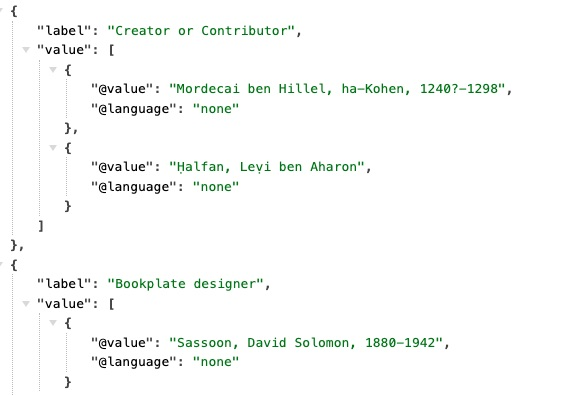

# Collections U of T Metadata Instructions

This page provides information about Collections U of T metadata.

For instructions on editing metadata and ingesting into Collections U of T refer to the [Collections U of T Admin UI onboarding and training](https://q.utoronto.ca/courses/429631/pages/welcome).

[This ALL FIELDS metadata template spreadsheet](https://utoronto.sharepoint.com/:x:/r/sites/001T_UTLWebContentCreators/Shared%20Documents/Collections%20U%20of%20T/TEMPLATE%20-%20Admin%20UI%20Ingest%20-%20ALL%20FIELDS%20-%20Last%20updated%202026-03-25.xlsx?d=wc0e1fb8cd90e42369e444f1941118db1&csf=1&web=1&e=eM824D) contains all of the available metadata fields in the Collections U of T index. Contact [digitalinitiatives@library.utoronto.ca](mailto:digitalinitiatives@library.utoronto.ca) for any metadata questions or support.

**Skip to:**
* [Getting Started](https://utlib.github.io/collections-uoft/documentation/metadata#getting-started-with-collections-u-of-t-metadata)
* [Collections U of T Element Details](https://utlib.github.io/collections-uoft/documentation/metadata#collections-u-of-t-element-details)
* [PID/Filename/Identifier Tips](https://utlib.github.io/collections-uoft/documentation/metadata#pidfilenameidentifier-tips)
* [Pre-Ingest Checklist](https://utlib.github.io/collections-uoft/documentation/metadata#pre-ingest-checklist)
* [Google Sheets Tips](https://utlib.github.io/collections-uoft/documentation/metadata#google-sheets-tips)
* [MARC > CSV - MARCEdit Tips](https://utlib.github.io/collections-uoft/documentation/metadata#marcedit-tips)
* [OpenRefine Tips](https://utlib.github.io/collections-uoft/documentation/metadata#openrefine-tips)
* [How do I update Metadata Labels on Collections U of T for my collection?](https://utlib.github.io/collections-uoft/documentation/metadata#how-do-i-alter-the-metadata-labels-that-publicly-display-for-my-collection-on-collections-u-of-t)

## Getting Started with Collections U of T Metadata

Prior to ingesting a collection you should confirm the metadata fields you want to use for display, search, and facetting in your repository. Each repository should be consistent in its use of metadata fields and any controlled vocabulary. It is up to each repository to define their metadata practices and train staff to create consistent metadata for their digital collections in Collections U of T.

The type of digital collection you are working with may also dictate how you create your metadata fields and collection structure:
* if you have existing MARC records to work with you can scroll to [MARC > CSV - MARCEdit Tips](https://utlib.github.io/collections-uoft/documentation/metadata#marcedit-tips) to read more about converting MARC records into a Collections U of T spreadsheet.
* if you have archival description from portions of a digitized fonds, or an existing database of metadata, email [digitalinitiatives@library.utoronto.ca](mailto:digitalinitiatives@library.utoronto.ca) for metadata exporting and mapping help.
* if you are creating your metadata spreadsheet from scratch, start by emailing [digitalinitiatives@library.utoronto.ca](mailto:digitalinitiatives@library.utoronto.ca) with a request for support to review the [ALL FIELDS template spreadsheet](https://utoronto.sharepoint.com/:x:/r/sites/001T_UTLWebContentCreators/Shared%20Documents/Collections%20U%20of%20T/TEMPLATE%20-%20Admin%20UI%20Ingest%20-%20ALL%20FIELDS%20-%20Last%20updated%202026-03-25.xlsx?d=wc0e1fb8cd90e42369e444f1941118db1&csf=1&web=1&e=eM824D), available in Sharepoint, and decide on the fields you would like to use.

After confirming the metadata fields you would like to use for your collection, copy or download the [ALL FIELDS template spreadsheet](https://utoronto.sharepoint.com/:x:/r/sites/001T_UTLWebContentCreators/Shared%20Documents/Collections%20U%20of%20T/TEMPLATE%20-%20Admin%20UI%20Ingest%20-%20ALL%20FIELDS%20-%20Last%20updated%202026-03-25.xlsx?d=wc0e1fb8cd90e42369e444f1941118db1&csf=1&web=1&e=eM824D). Rename the spreadsheet with the PID or title of your collection. It can be helpful to have **one spreadsheet per top-level collection** so you can use the sheet to normalize metadata values if you add new items. It is up to each repository to manage their metadata spreadsheets - Collections U of T does not store any original metadata spreadsheets after ingest. 

## Collections U of T Element Details

After creating your spreadsheet from the [ALL FIELDS template](https://utoronto.sharepoint.com/:x:/r/sites/001T_UTLWebContentCreators/Shared%20Documents/Collections%20U%20of%20T/TEMPLATE%20-%20Admin%20UI%20Ingest%20-%20ALL%20FIELDS%20-%20Last%20updated%202026-03-25.xlsx?d=wc0e1fb8cd90e42369e444f1941118db1&csf=1&web=1&e=eM824D), begin filling in the spreadsheet for your collection(s) based on the [Collections U of T Metadata Element Details](https://utlib.github.io/collections-uoft/documentation/metadata_elements). 

If you have any questions about any of the elements or would like help converting existing metadata into the spreadsheet you can always contact Collections U of T staff for support.

### PID/Filename/Identifier Tips

The `pid` column in the spreadsheet template is one of the most important columns as the PID dictates the permalink URL to any items you ingest into Collections U of T. For more information about PIDs see this [slide deck](https://docs.google.com/presentation/d/1W2PWTBE22rj15h7FbVDgAv5DIfg33rnn-1vLQZ_qgDw/edit?usp=sharing) on PID/Filename/Identifier tips. 

## Pre-Ingest Checklist

After you have filled in your metadata spreadsheet:
* Check that PIDs are correctly formatted (see above)
* Check for entity codes - i.e. *$amp;* in place of *&*. Note that you *are* able to represent the actual special character in the spreadsheet metadata - i.e. *&*. The ingest script accepts special characters - so long as spreadsheets are saved with UTF-8 encoding
* Check each column you have filled in against the [Element Details](https://utlib.github.io/collections-uoft/documentation/metadata_elements) to ensure you are following Collections U of T metadata rules
* Check for spelling errors
* Check for duplicate words or terms
* Check that the file paths to your digital images are correct

## MARCEdit

For digitized items that have existing MARC records, [MARCEdit](https://marcedit.reeset.net/) can be used to create metadata spreadsheets for ingest into Collections U of T. MARCEdit is an external, open source tool used to interact with MARC metadata. 

Benefits of using this method: if MARC metadata already exists for digitized items, the MARCEdit work flow reduces human error in copying and pasting metadata into a spreadsheet. It can also help you batch extract MARC metadata into a spreadsheet, saving time if you have a significant number of MARC records that you want to convert into a spreadsheet for ingest into Collections U of T.

Drawbacks: this work flow may introduce human error in mapping the resulting spreadsheet columns to the Collections U of T metadata spreadsheet. You will also need to ensure you tidy up any formatting specific to MARC from the spreadsheet prior to ingest. Read on to understand more. 

You can read more general tips about using MARCEdit in [UTL staff documentation](https://connect.library.utoronto.ca/ERM/Documentation%20%26%20General%20Procedures/MarcEdit/) (external link - requires VPN + UTORid to access). You can also find additional MARDEdit documentation on [YouTube (external link)](https://www.youtube.com/results?search_query=marcedit).

### Getting Access to MARCEdit

**Step 1:** Get access to MARCEdit on your UTL workstation or download MARCEdit to your laptop from [https://marcedit.reeset.net/downloads](https://marcedit.reeset.net/downloads). Once you have access, follow the set up prompts (you can just use the default settings). Requesting this on your UTL workstation may take some time - plan ahead and request it well in advance of when you need to complete your metadata work.

**Step 2:** Once installed, set up MARCEdit and access to the UTL Catalog. Set up may take some time - reach out if you need support. Remember: once everything is set up, you won't have to repeat Steps 1 and 2.

Once MARCEdit is installed and set up, you will need to add the University of Toronto Libraries Catalog information. To do this, follow the [internal UTL staff documentation from Metadata Services](https://connect.library.utoronto.ca/ERM/Documentation%20%26%20General%20Procedures/MarcEdit/Z39.50%20Queries/Setting%20up%20UTL%20in%20MarcEdit%20Z39.50/) (external link - requires VPN + UTORid to access) to set up the Z.39.50/SRU Client.

Note, also, that you may need to install Homebrew and Yaz via Terminal if you are setting up MARCEdit on a Mac and not a PC workstation. If you get an error message when clicking on Z39.50 - follow these steps: [https://marcedit.reeset.net/marcedit-mac-enabling-z39-50-support](https://marcedit.reeset.net/marcedit-mac-enabling-z39-50-support). Ask for help from your supervisor or ITS if you get stuck at this step.

**Step 3:** Once set up, click "Z.39.50/SRU Client" to access the UTL catalog (this is where you will download MARC files from).

_More documentation is forthcoming on converting MARC to spreadsheet data in the [Admin UI training](https://q.utoronto.ca/courses/429631/pages/welcome)._

## OpenRefine

If you prefer to edit your spreadsheet using OpenRefine, consult the [OpenRefine documentation](https://openrefine.org/docs) or check out U of T's [Map and Data Library OpenRefine tutorials](https://mdl.library.utoronto.ca/tools/openrefine).

Note that if you are working in Google Sheets, you can load the data into OpenRefine directly from Google Sheets by following [these instructions](https://openrefine.org/docs/manual/starting#google-data). Make sure the spreadsheet is a Google Sheet and not an .xlsx document stored in your Google Drive. 

## How do I alter the metadata labels that publicly display for my collection on Collections U of T?

All collections share the same metadata schema (see above documentation). It is possible to submit a request to change the labels of the metadata for your repository. To change the display labels of metadata for your repository's collection(s) please [email Collections U of T ITS staff](mailto:digitalinitiatives@library.utoronto.ca) to request a consultation about modifying metadata labels. If it is possible to accommodate your requested changes, ITS will modify [internal metadata mapping documents](https://git.library.utoronto.ca/utl-its/digital-collections/collections-lookup/-/tree/main/src/config/metadataMapping?ref_type=heads). Note that these internal metadata display documents also control the labels in your repository's IIIF manifests.

For values in the Creator / Contributor field the role term you select in the *creator_contributor_role* column will become the metadata label for the name entered in the *creator_contributor* column. If you enter "none", or do not enter anything into the role term column, then the default display label will be Creator / Contributor. Here is an example of names entered with "none" as well as "bookplate designer" for manuscript [fisher2:11952](https://collections.library.utoronto.ca/view/fisher2:11952).

