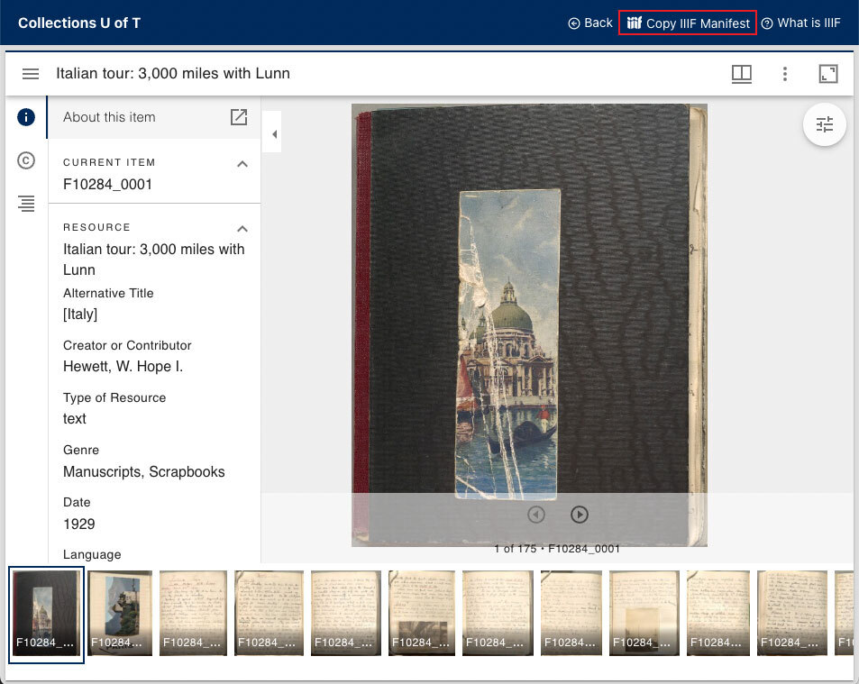
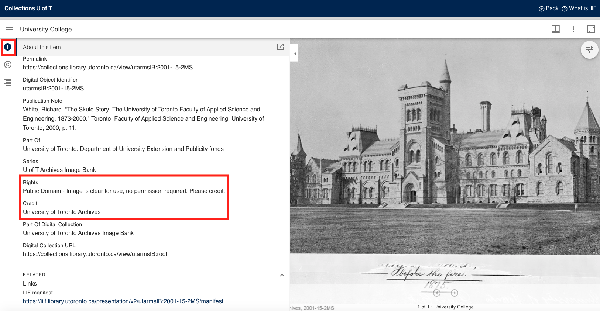
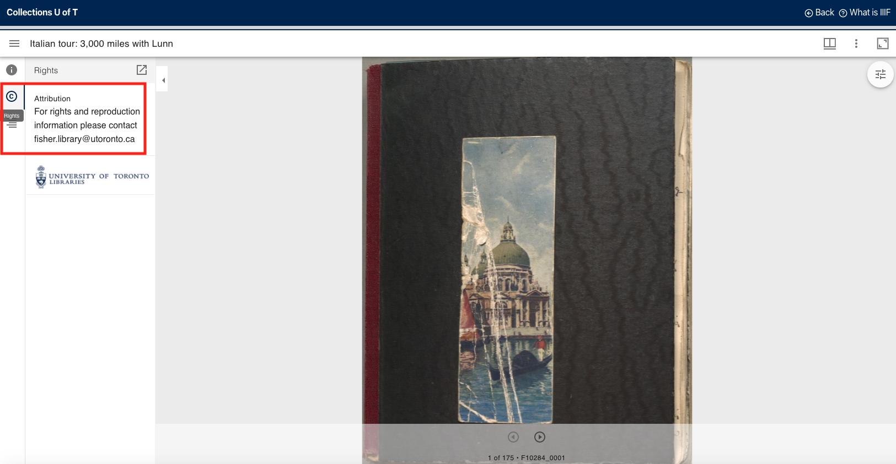
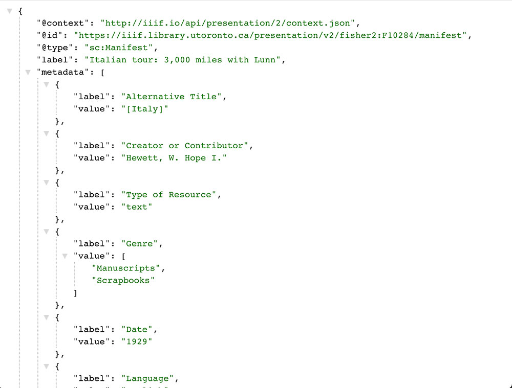

# What is IIIF?

[IIIF (International Image Interoperability Framework)](http://iiif.io/) is a set of APIs and related tools created by an international community of leading cultural institutions. The IIIF community has created documentation to help you learn how to use the [IIIF APIs](https://iiif.io/get-started/how-iiif-works/), how to use the [IIIF Mirador viewer](https://iiif.io/guides/using_iiif_resources/#mirador), and how to [find other IIIF digitized collections](https://iiif.io/guides/finding_resources/) from cultural heritage institutions across the globe. Below you will find additional IIIF documentation specific to Collections U of T and the University of Toronto's IIIF digital collections.

## IIIF in Collections U of T

Each digitized object in Collections U of T has something called a **IIIF manifest**. On each digital object's view page, you will see a *Copy IIIF Manifest* button in the top right corner of the display.

This button is intended to make it easy for you to copy IIIF manifests for digital objects you are interested in reusing. IIIF manifests contain information about the images and metadata for digitized objects and allow for the reuse of the digitized objects they represent. You can also access **all** Collections U of T IIIF manifests at [https://iiif.library.utoronto.ca/presentation/v2/collections](https://iiif.library.utoronto.ca/presentation/v2/collections).

## Collections U of T URL paths

The URL path for a digital object is always `https:/collections.library.utoronto.ca/view/**PID**` - where PID is the identifier for the digital object.

Similarly, The URL path for a digital object's manifest is always `https://iiif.library.utoronto.ca/presentation/**PID**/manifest` - where, again, PID is the identifier for the digital object.

Note that IIIF collections manifests follow a different URL pattern. Collection manifests are always `https://iiif.library.utoronto.ca/presentation/collections/**PID**` - where PID is the identifier for the digital collection.

## Where can I find copyright and reuse information in Collections U of T? 
Every collection differs in rights and reuse guidelines. Some collections do not allow for reuse, while others do. For any digital object you are interested in reusing, please refer to the \"Rights\" field in the digital object(s) "information" section of the image viewer. 

Some collections may not have rights information. For these, a contact email is given. When in doubt, use the contact information to connect with library and archives staff about reuse and permissions.

## What can I do with IIIF manifests? 
Once you have copied a IIIF manifest, you can paste it into a number of open tools to reuse the image. Note that IIIF manifests are accessible through URLs (links). IIIF manifest URLs point to a publicly accessible document, written in a format called JSON (or JavaScript Object Notation). Clicking on the IIIF manifest link, or pasting the URL into your browser, will lead you to a document that looks like this:

Instead of clicking on the link, you want to **copy** the IIIF manifest of the digital object you are working with *into* the tool of your choice. 

Here are some examples of externally hosted IIIF-enabled tools that you can work with:

* [Omeka](https://www.omeka.net/) - a digital exhibition platform. The University of Toronto Libraries also offers an Omeka service for U of T users through [Exhibits U of T](https://exhibits.library.utoronto.ca/start).
* [From The Page](https://fromthepage.com/) - a subscription-based transcription tool.
* [Exhibits](https://www.exhibit.so/) - a free digital storytelling and exhibits tool created by Mnemoscene and the University of St. Andrews

Each tool will have documentation about how to copy a IIIF manifest into the tool to get you started in working with the IIIF images of your choosing.

## Can I see examples of IIIF in use in student assignments and teaching?
Yes, please contact [digitalinitiatives@library.utoronto.ca](mailto:digitalinitiatives@library.utoronto.ca) for more information.
