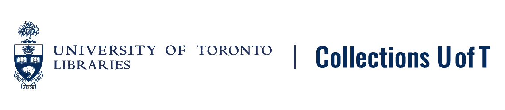

# Policies and Documentation

*[Collections U of T](https://collections-beta.library.utoronto.ca)* is the  University of Toronto Libraries' image repository for UTL digitized special collections and archives. 

**This site contains staff policy & procedures documentation.**

If you are looking for documentation and help for browsing and searching in *Collections U of T* visit the public help pages at [https://collections-beta.library.utoronto.ca/explore/help](https://collections-beta.library.utoronto.ca/explore/help).

> ***The New Collections application and website is launching in Spring 2024. Go to the [2024 Migration Guide](https://utlib.github.io/collections-uoft/documentation/2024-migration-guide) for more information.***

> ***Please note from July 2024 - Summer 2025 the Collections U of T service will be operating in maintenance mode with reduced staff capacity.***

**Skip to:**
* [About Collections U of T](index.md#about-collections-u-of-t)
* [Collections U of T policies](index.md#collections-u-of-t-policies)
* [Help finding and using images in Collections U of T](https://collections.library.utoronto.ca/explore/help) (page not yet published)
* Documentation for collection owners:
    * [Requesting a top-level collection](documentation/adding-new-collections.md)
    * [Metadata instructions](documentation/metadata.md)
    * [Ingest instructions](documentation/ingest-instructions.md)
    * [Transcription and Annotation tools for Collections U of T IIIF images](documentation/transcriptions-with-iiif.md)

## About Collections U of T
[Collections U of T](https://collections.library.utoronto.ca) is the  University of Toronto Libraries' image repository for digitized special collections and archives. The service supports UTL special collections and archives staff in providing open access to digitized special collections and archives through the [International Image Interoperability Framework (IIIF)](https://iiif.io/) and standard metadata formats. 

Collections U of T provides U of T staff:

1. Collection management and digital object storage for university special collections and archives image collections
2. Indexing for digital object metadata
3. Search and discovery for collections and digital objects
4. User management and authentication (CRUD for collections and digital objects)
5. Statistics for collections and digital objects
6. The ability to create "simple pages" for content _about_ collections and items stored in Collections U of T

Collections U of T is *not*:
* A digitization service
* A digital exhibit service
* A digital preservation service
* Currently structured to store media types other than _image files_. Collections U of T does not currently support .pdf, audio, or video collections
* Open to anyone for use - digital collections must be *assessed* prior to inclusion in Collections U of T. Because the service is intended for providing long term discovery and access for digital image collections, the digital objects must belong to a UTL department or archives for long term care and maintenance purposes. Collections from external organizations must be assessed by a UTL department and acquired via formal agreement with the external organization prior to inclusion in Collections U of T. Collections U of T is not intended for hosting digitized content from external institutions. Note that UTL collection owners are responsible for assessing digital objects for accessibility, privacy and copyright considerations, as well as staffing capacity to support the care and maintenance of the digital collection over time. 

### Collections U of T Policies

Last updated 2024.03.14

#### Collection Guidelines

1. Digital collections or digital objects deposited into Collections U of T are published with the intent of access in perpetuity. All content ingested into Collections U of T will be public. Collections U of T does not currently have any collection or item restriction features - all images in the repository are publicly accessible and publicly downloadable. If you require storage for digital image collections but need to restrict access or downloads to internal UTL or U of T users, please [contact us](mailto:digitalinitiatives@library.utoronto.ca). 
2. The repository is structured by top-level U of T library or archives. Any content added to Collections U of T *must* belong to a top-level collection reflecting the UTL library or archives department responsible for the long term maintenance of the digitized items and collections. The top-level collection library or archives is referred to as the "collection owner".
3. To create a new top-level collection and obtain logins, U of T library or archives staff can request a consultation for Collections U of T support at [digitalinitiatives@library.utoronto.ca](mailto:digitalinitiatives@library.utoronto.ca). 
4. Collection owners are responsible for reading and following Collections U of T policies.
5. Collections and items deposited into Collections U of T must not be ephemeral or intended for temporary access.
6. Collection owners must not deposit duplicates of the same item.
7. Collection owners must follow Canadian Copyright law when submitting items/collections to Collections U of T. If the collection owner does not hold the rights to publish the material online, permission must be obtained. Contact the UTL [Scholarly Communications and Copyright Office](https://onesearch.library.utoronto.ca/copyright/scholarly-communications-and-copyright-office) if you need support. 
8. Collection owners are responsible for assessing digital objects for accessibility, privacy, and copyright considerations, in addition to any emerging data care principles. Items submitted to Collections U of T will be accessible in perpetuity. This means digital objects and related data may require future staff time to maintain over time. Both current and future staffing capacity to support the care and maintenance of the digital collection should be assessed prior to publishing data in Collections U of T.
9. Collection owners must follow Collections U of T metadata guidelines.
10. Collections U of T is not a preservation repository. Collection owners are responsible for the preservation of the digital files they use to create items in Collections U of T.

#### Format Support

Collections U of T is a digital image repository that currently accepts the following file formats: TIFF, JPEG 2000, JPEG, and PNG. Please note that only files in these formats can be uploaded to the repository at this time.

### List of Top-Level Collections in Collections U of T

As of March 2024, Collections U of T holds selected digital objects for the following libraries and archives:
* [University of Toronto Archives Online](https://collections-beta.library.utoronto.ca/view/utarms:root)
* University of Toronto's East Asian Library and the University of British Columbia's [Korean Canadian Heritage Archives](https://collections-beta.library.utoronto.ca/view/eal3:root)
* [Richard Charles Lee Canada-Hong Kong Library Digital Collections
](https://collections-beta.library.utoronto.ca/view/rclc-hkl:root)
* [University of Toronto Map and Data Library](https://collections-beta.library.utoronto.ca/view/mdl:root)
* [University of Toronto Music Library](https://collections-beta.library.utoronto.ca/view/musiclibrary:root)
* [University of Toronto Richard Charles Lee Canada-Hong Kong Library](https://collections-beta.library.utoronto.ca/view/rclc-hkl:root)
* University of St. Michael's College, including:
    * [John M. Kelly Library Special Collections](https://collections-beta.library.utoronto.ca/view/usmc:root)
    * [University of St. Michael's College Archives](https://collections-beta.library.utoronto.ca/view/usmc-archives:root)
* [University of Toronto Thomas Fisher Rare Book Library](https://collections-beta.library.utoronto.ca/view/fisher:root), including:
    * [The Discovery and Early Development of Insulin](https://collections-beta.library.utoronto.ca/view/insulin:root)
    * [Anatomia Collection: anatomical plates, 1522-1867](https://collections-beta.library.utoronto.ca/view/anatomia:root)
    * [The Wenceslaus Hollar Collection](https://collections-beta.library.utoronto.ca/view/hollar:root)

Legacy digital projects making use of Collections U of T include:
* Ann Komaromi's *[Project for the Study of Dissidence and Samizdat](https://collections-beta.library.utoronto.ca/view/samizdat:root)*
* *[French](https://french.newberry.t-pen.org/)* and *[Italian Paleography](https://italian.newberry.t-pen.org/)*, supported by a grant from The Andrew W. Mellon Foundation and completed in partnership with the Newberry Library and the Walter J. Ong Centre for Digital Humanities at Saint Louis University
* Pamela Klassen's *[Story Nations](https://storynations.utoronto.ca/index.php/the-diary/the-digital-edition/manuscript-and-transcription/)*

## What is Collections U of T IIIF?

IIIF (International Image Interoperability Framework) is a set of APIs and related tools created by an international community of leading cultural institutions. The IIIF community has created [a guide](https://iiif.io/guides/using_iiif_resources/) to help you get started in learning about IIIF and how to make use of it.

Our ["What is IIIF?"](documentation/iiif-collections.md) page also includes IIIF documentation specific to Collections U of T. 

## Metadata and Data Model

The Collections U of T data model is available upon request.

## Descriptive Metadata Standards
Historically, Collections U of T has used [MODS](https://www.loc.gov/standards/mods/userguide/generalapp.html)-based descriptive metadata formatted as spreadsheets and then converted to xml, or MARC converted to MODS xml via [MarcEdit](https://marcedit.reeset.net/). Descriptive metadata is also converted to JSON in Collections U of T IIIF manifests for display purposes. 

For help with Collections U of T metadata, read the Collections U of T Metadata Instructions page. 

## Metadata Templates

* [Collections U of T metadata spreadsheet template - all fields](https://docs.google.com/spreadsheets/d/1PMtZt5CzkidIXbTBUaoi8Qg7kBU-m9RzeM-lBMORPks/edit?usp=sharing)
* [Collections U of T Metadata Profile - Element Details](https://docs.google.com/spreadsheets/d/1EidYREGS521xZKoxBN3Fl-PzkJnNJAR_zftuXXwQsZg/edit?usp=sharing)
* Collections U of T metadata mapping:
    - [MODS xml mapping](/xml_mods_collections_uoft_mapping.xml)
    - Wikidata properties (to be completed)

Are you ready to start adding metadata to the Collections U of T spreadsheet? [See instructions](documentation/metadata.md).

## Other UTL Services

Collections U of T is just one of the many services offered by the University of Toronto Libraries. Here are some other services that might be of interest or helpful in your work or research:
* [Discover Archives](https://discoverarchives.library.utoronto.ca/)
* [Exhibits U of T](https://exhibits.library.utoronto.ca/)
* [TSpace](https://tspace.library.utoronto.ca/?refresh=true)
* [Find out more about the University of Toronto Libraries](https://onesearch.library.utoronto.ca/)
